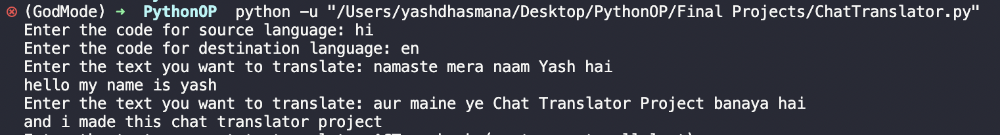

# Python Projects

### PasswordGenerator.py
This program generates a strong 14 character random password and also prompts the user to enter the choice between a strong password and a super strong password(same 14 char but even more random)

### ChatTranslator.py
This program translates text from one language to another using the google trans library.

###
